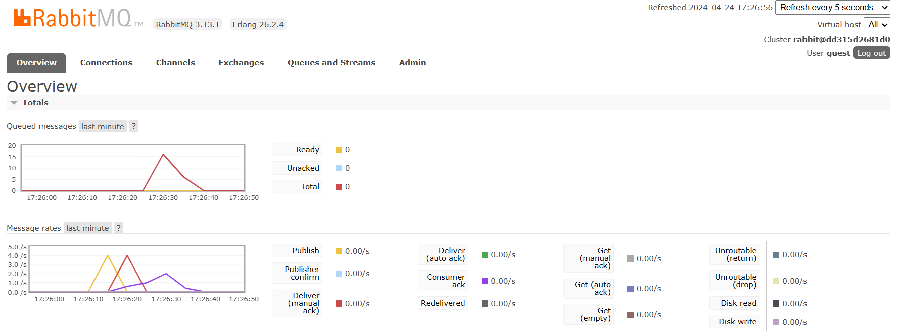
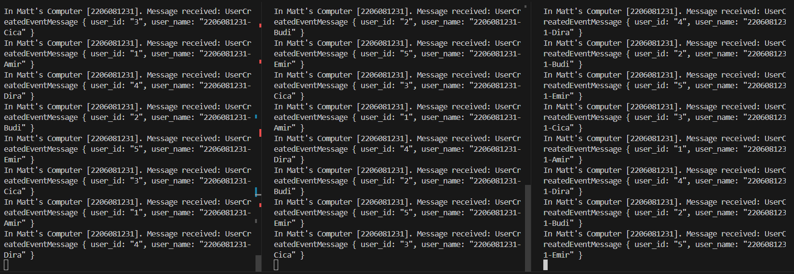
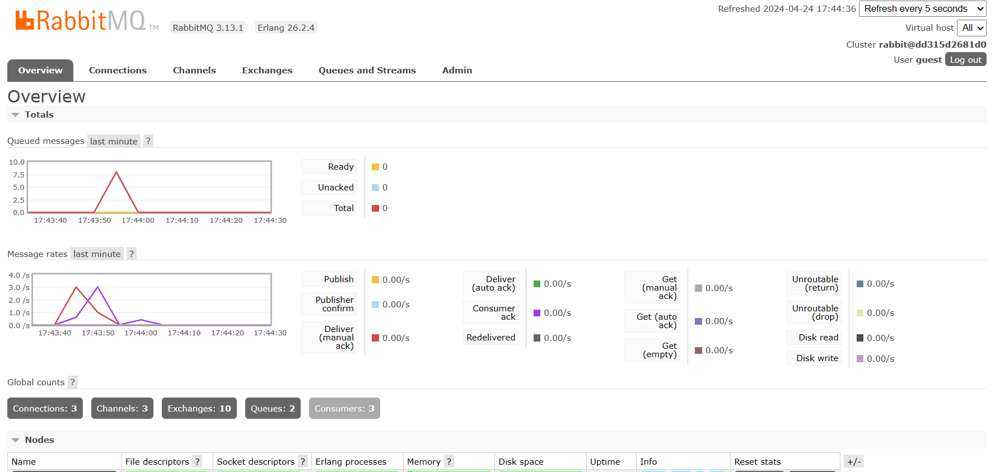

a. What is amqp?

AMQP stands for Advanced Message Queuing Protocol. It's an open standard application layer protocol for message-oriented middleware, allowing applications to communicate asynchronously by sending messages between them. AMQP is designed to efficiently support a wide variety of messaging patterns, including point-to-point, publish/subscribe, request/reply, and more.

b. What it means? guest:guest@localhost:5672, what is the first guest, and what is the second guest, and what is localhost:5672 for?

guest:guest@localhost:5672 is the credential for the connection of AMQP server.
The first guest in guest:guest is the username, and the second guest is the password
localhost is the hostname and 5672 is the port number. Localhost means it is running on local machine.

- Slow subscriber

There is an increase of message queue (15 message queue). That's because the publisher publishes multiple messages in a short time, so it had to be queued.

- Three Subscribers

From the console it can be seen that the subscribers receives different data when the publisher publishes a lot of data. The spike from reduces quicker because there are more instances of subscribers, so thus the queue reduces.